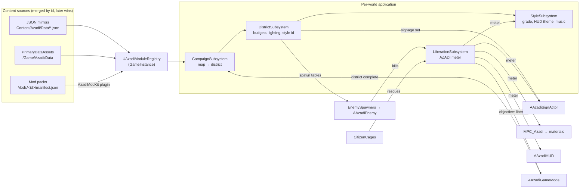

# AZADI UE5 — Architecture (v1)

Modular, data-driven UE5 FPS. This document maps the system so designers, engineers, and modders share one mental model. The browser game's design canon (districts, enemies, weapons, liberation loop) lives in the repo root; this is its UE5 incarnation — not a port.

**Stack:** Unreal Engine 5.7 (Lumen, Enhanced Input), C++ game module + plugin, JSON-mirrored data, Python editor bootstrap. Zero binary assets in the repo — everything visual is generated or engine content until kitbash packs land.

---

## Quickstart

```bash
# 1. Compile (UE 5.7 installed via Epic Games Launcher)
"/Users/Shared/Epic Games/UE_5.7/Engine/Build/BatchFiles/Mac/Build.sh" \
  AzadiEditor Mac Development -Project="$PWD/ue5/azadi/azadi.uproject"

# 2. Build graybox maps + materials (headless, one-time; --force rebuilds)
"/Users/Shared/Epic Games/UE_5.7/Engine/Binaries/Mac/UnrealEditor-Cmd" \
  "$PWD/ue5/azadi/azadi.uproject" \
  -ExecutePythonScript="$PWD/ue5/azadi/Content/Python/azadi_bootstrap.py" \
  -RenderOffScreen -unattended -nopause -nosplash

# 3. Open the editor and press Play (L_Bazaar is the startup map)
open "ue5/azadi/azadi.uproject"
```

Or from the repo root: `make ue5-build ue5-bootstrap ue5-open`.

In-editor, the bootstrap is also available from the Output Log (Cmd → Python): `py azadi_bootstrap.py`.

---

## Core principles

1. **Modular** — gameplay features are subsystems; content arrives through a registry, not hard references.
2. **Customizable** — designers tune `F*Def` structs via DataAssets *or* JSON; no recompiles.
3. **Data-driven** — campaign order, spawn tables, signage sets, style packs, liberation tuning all live in `Content/Azadi/Data/`.
4. **Ship slices** — `L_Bazaar` graybox is playable end-to-end before any art lands.

---

## Module map

The prompt-level "module table" maps to concrete classes:

| Module | Class | Kind | Responsibility |
|--------|-------|------|----------------|
| Registry hub | `UAzadiModuleRegistry` | GameInstance subsystem | Merge content from JSON → DataAssets → mods; id-keyed lookup; texture/sound resolution (incl. runtime PNG import) |
| Campaign | `UAzadiCampaignSubsystem` | GameInstance subsystem | District order, completion, level travel |
| Liberation | `UAzadiLiberationSubsystem` | World subsystem | AZADI meter, milestones, combat tension; pushes to `MPC_Azadi` |
| District | `UAzadiDistrictSubsystem` | World subsystem | Applies district def to loaded world: spawner budgets, lighting preset, style pack selection |
| StylePack | `UAzadiStyleSubsystem` | World subsystem | HUD theme, post-process grade (lerps toward "liberated" look), music stems, stingers |
| Combat | `UAzadiWeaponComponent`, `UAzadiHealthComponent`, `AAzadiProjectile` | Components/actor | Data-driven weapons (hitscan/projectile/melee/chant), ADS, teams |
| Enemies | `AAzadiEnemy` + `AAzadiEnemyController` + `AAzadiEnemySpawner` | Actors | One enemy class, six behaviors via `FAzadiEnemyDef`; nav chase with direct-steer fallback |
| World hooks | `AAzadiSignActor`, `AAzadiCitizenCage`, `AAzadiExitZone`, `AAzadiLiberationResponder` | Actors | Signage swap, rescues, objectives, hope-reactive props |
| ModKit | `UAzadiModKitSubsystem` | Plugin subsystem | Discovers `Mods/<id>/manifest.json`, layers packs onto the registry |
| Session | `AAzadiGameMode` | GameMode | Objective tracking, enemy budget gate, respawn, district completion |
| Player | `AAzadiCharacter`, `AAzadiPlayerController`, `AAzadiHUD` | Actors | Runtime-built Enhanced Input, ADS camera, canvas HUD skinned by StylePack |

---

## Data flow



**The liberation loop:** kills (`LiberationReward`) and rescues (`RescueReward`) raise the meter → signage flips from propaganda to murals at the district's threshold, the color grade saturates toward the pack's liberated look, festoons/props appear via responders, music crossfades — and `Liberate` districts complete at 1.0.

---

## Schema (one source of truth)

All tunables are plain USTRUCTs in `Source/Azadi/Data/AzadiTypes.h`:

| Struct | JSON `type` | Keys |
|--------|------------|------|
| `FAzadiCampaignDef` | `campaign` | ordered district ids |
| `FAzadiDistrictDef` | `district` | map, objective (`ReachExit`/`Liberate`/`Rescue`/`Clear`), style/signage/asset pack ids, enemy budget + spawn table, loadout, lighting preset, flip threshold |
| `FAzadiWeaponDef` | `weapon` | kind (`Hitscan`/`Projectile`/`Melee`/`Chant`), damage, fire interval, pellets, spread, ADS fov/mul, ammo, reload, recoil, splash, chant impulse, sounds |
| `FAzadiEnemyDef` | `enemy` | health, speed, attack kind/range/interval, sight, liberation reward, scale, placeholder tint, optional mesh path |
| `FAzadiStylePackDef` | `stylepack` | HUD colors + font, grade (saturation/contrast/tint/vignette/bloom/grain + liberated variants), music stems, stingers |
| `FAzadiSignageSetDef` | `signageset` | slots: occupied + liberated texture refs |
| `FAzadiAssetPackDef` | `assetpack` | named mesh/material slots for kitbash binding |

Data files are self-describing: `{ "type": "district", "items": [ ... ] }`. The same parser serves core data and mods. `UAzadi*DataAsset` wrappers expose the same structs to the editor; assets override JSON by id.

**Texture refs** support two forms: `/Game/Path.Asset` (content) and `file:relative.png` (raw PNG imported at runtime — the mod-friendly path, also used by the placeholder signage in `Data/SignageSets/textures/`).

---

## Directory layout

```
ue5/azadi/
  azadi.uproject              UE 5.7, code-only
  Config/                     GameMode/map defaults, AssetManager scan, Enhanced Input
  Source/Azadi/
    Data/                     AzadiTypes.h (schema) + DataAsset wrappers
    Core/                     Registry, Campaign, Liberation, District, Style, GameMode
    Combat/                   Health, Weapon component, Projectile
    AI/                       Enemy, EnemyController, EnemySpawner
    Player/                   Character, PlayerController, HUD
    World/                    SignActor, CitizenCage, ExitZone, LiberationResponder
  Plugins/AzadiModKit/        mod pack discovery + loading (see docs/MODDING.md)
  Content/
    Azadi/Data/               JSON mirrors + placeholder signage PNGs
    Python/                   azadi_bootstrap.py (graybox builder), init_unreal.py
  Mods/example_neon_dawn/     working example mod pack
  tools/gen_placeholder_signage.py   stdlib PNG generator (no PIL)
  docs/                       this file + MODDING.md
```

Maps (`/Game/Azadi/Maps/L_*`) and materials (`M_AzadiSolid`, `M_AzadiSign`, `MPC_Azadi`) are **generated** by the bootstrap script and intentionally not committed in v1 — rebuild with `--force` at any time.

---

## The five districts

| District | Map | Objective | Beat |
|----------|-----|-----------|------|
| `rooftops` | `L_Rooftops` | ReachExit | night traversal, escape (stub) |
| `bazaar` | `L_Bazaar` | ReachExit | **vertical slice**: street, alleys, stalls, arches, courtyards, barricade, plaza |
| `detention` | `L_Detention` | Rescue | free 3 cages (stub) |
| `tv_tower` | `L_TVTower` | Clear | break 20 patrols (stub) |
| `plaza` | `L_Plaza` | Liberate | boss arena — Supreme Shadow worth 0.5 AZADI (stub) |

Adding a district = a map + a `district` JSON entry (or DataAsset) + a campaign id. No core edits — mods can do it too.

---

## Environment & kitbash plan

Graybox volumes are placeholders for the kitbash stack (Modular Village, Leartes Town Gigapack, Desert City, Megascans + riot props). The binding contract is `FAzadiAssetPackDef` mesh/material slots; the bootstrap names every volume (`BldW_2`, `Stall_3`, `Arch_0`...) so a swap pass can be scripted. **Persian signage is the realism priority** — it flows through signage sets (texture-only, moddable) rather than baked level art.

Lighting: `Lumen + SkyAtmosphere`; districts pick `dusk` / `night` / `noon` presets applied to the tagged sun (`AzadiSun`).

---

## Known v1 gaps (deliberate)

- No save/persistence; campaign progress is per-session.
- Enemy bodies are tinted primitives until mesh packs land (`MeshPath` is already honored).
- Farsi RTL HUD pending a font asset with Arabic-script glyphs (`FontPath` slot exists per StylePack); strings stay English meanwhile.
- Music silent until stem assets exist (`MusicCalm/Combat/Anthem` refs are wired).
- Maps/materials are generated, not committed; cook/pak flow for mod maps is documented but not automated.
- AI uses navmesh when present, straight-line steering otherwise.

---

## Verify

```bash
make ue5-build     # compile (UBT)
make ue5-bootstrap # rebuild graybox content
make ue5-game      # headless boot into L_Bazaar (smoke test)
```

The TypeScript game's `make check` is unaffected by the UE5 tree.
